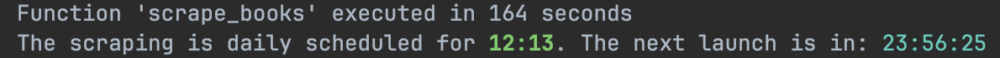

# Web Scraping Project

## Описание проекта

Предназначен для парсинга данных с сайта [Books to Scrape](https://books.toscrape.com/catalogue/page-1.html) - демонстрационного ресурса для обучения веб-скрапингу.

## Функциональность

- Сбор данных о книгах с [Books to Scrape](https://books.toscrape.com/catalogue/page-1.html)
- Сохранение в структурированном формате
- Отслеживание прогресса скачивания

## Использование

### Инструкция к запуску скрипта и тестов:

1. **Перейти в папку проекта в терминале**
 ```
cd ../books_scraper
```

2. **Установить зависимости:**
```
pip install -r requirements.txt
```
В результате будут установлены следующие библиотеки:
```python
### Файл requirements.txt
```txt
beautifulsoup4==4.14.2
requests==2.32.5
schedule==1.2.2
rich==13.0.0
pytest==7.4.0
pytest-mock==3.11.0
```

3. **Запустить скрипт (два варианта запуска):**

- Вариант 1. Запуск с временем срабатывания по дефолту (в 19:00) 

```
python scraper.py
```
- Вариант 2. Запуск с произвольным временем срабатывания, например:  

```
python run_scraper.py "12:13"
```

- на этом этапе в терминале появится информация об остатке времени до 
запланированного запуска:


- в момент наступления времени сработки функции, появится окно прогресса обработки книг:


- в результате выполнения функции, появится файл books_data.txt в папке /artifacts (если файл уже существует, то предыдущий будет перезаписан), а так же появится информация о времени, затраченном на выполнение функции и начнется новый отсчет до следующей сработки функции:


4. **Если нужно прервать выполнение функции, нажмите одновременно клавиши Ctr + C**


5. **Запуск тестов:**
```
python -m pytest tests/test_scraper.py
```

#### Какие тесты будут запущены:

##### `test_get_book_data_invalid_url`
**Назначение**: Проверяет правильность URL-адреса для функции `get_book_data`

**Что проверяет**:
 - Недопустимые URL-адреса вызывают исключение ScraperException с соответствующим сообщением об ошибке
 - Проверяет различные недопустимые форматы URL-адресов (неверный протокол, неполный URL, отсутствие протокола, опечатки в протоколе)

#### `test_scrape_books_at_time_invalid_time`
**Назначение**: Проверяет правильность формата времени для планирования скрапинга

**Что проверяет**:
 - Недопустимые форматы времени вызывают исключение ScraperException
 - Проверяет формат ЧЧ:ММ с соответствующими диапазонами значений

#### `test_get_book_data_returns_correct_data`
**Назначение**: Проверить полное извлечение данных с одной страницы книги

**Имитационные данные**: Мокируется HTTP запрос для обработки предопределенной HTML-страницы одной книги

**Что проверяет**:
 - Возвращает словарь со всеми ожидаемыми ключами
 - Правильные типы данных для всех полей
 - Точное извлечение определенных значений из HTML
 - Правильная обработка ошибок при обнаружении отсутствующих элементов

#### `test_scrape_books_returns_correct_data`
**Назначение**: Тестирует обработку всех книг из каталога

**Имитационные данные**: Мокируется HTTP запрос и используются 5 предопределенных HTML-страниц книги

**Что проверяет**:
 - Возвращает список словарей
 - Правильное количество извлеченных книг (5 в тестовых данных)
 - Каждая книга содержит все необходимые поля
 - Согласованность структуры данных во всех книгах

#### `test_scrape_books_creates_correct_file`
**Назначение**: тестирует создание файла, сохранение данных и соответствие сохраняемых данных ожидаемому результату

**Имитационная стратегия**:
 - Имитирует "Path", чтобы избежать реальных операций с файловой системой
 - Перехватывает операции записи файла для захвата содержимого
 - Сравнивает перехваченное содержание с ожидаемым результатом (с содержимым тестового файла 'tests/resources/scrape_books/books_data.txt')

**Что проверяет**:
 - Записывает корректные данные в файл, когда `is_save=True`
 - Содержимое файла соответствует ожидаемому формату
 - Корректная обработка файла и кодировка


### Если команды не работают:
- Используйте `pip3` вместо `pip`
- Используйте `python3` вместо `python`
- Убедитесь что Python 3.8+ установлен

### Используемые библиотеки

#### Стандартные библиотеки Python
- `json`, `re`, `sys`, `time`, `datetime`
- `functools`, `pathlib`, `urllib.parse`

#### Сторонние библиотеки
- **requests** - выполнение HTTP-запросов
- **schedule** - планирование периодических задач
- **beautifulsoup4** - парсинг HTML и XML документов
- **rich** - улучшенное форматирование вывода в терминале:
  - **Прогресс-бар** обработки книг с процентным выполнением
  - **Таймер** до следующего запуска задач
  - **Live-обновление** статуса скрапинга в реальном времени